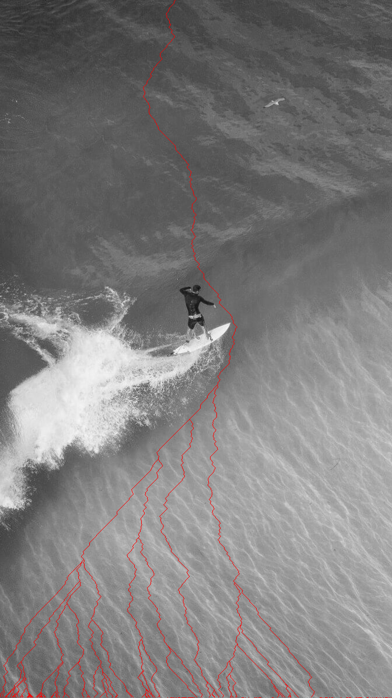

# Course Projects

## Protect The Idiot! : C#

Sample Code: `IdiotAI.cs` This code is responsible for the behavior of The Idiot.

> Not the best quality gif but a showcase of the functionality in the script.

## Blinn Shader : GLSL, OpenGL, Java

*Unfortunately, it is against UMD Academic Integrity Policy to post any of the code for this assignment*

The gif below shows my implementation of the Blinn shader including implementations of a trackball, colored point lights, and textures.

## Image Carver : Python

*Unfortunately, it is against UMD Academic Integrity Policy to post any of the code for this assignment*

Reduces an image to the desired dimensions by iteratively removing vertical strips of pixels that change least from it's neighbor pixels.

### Before and After Carve

